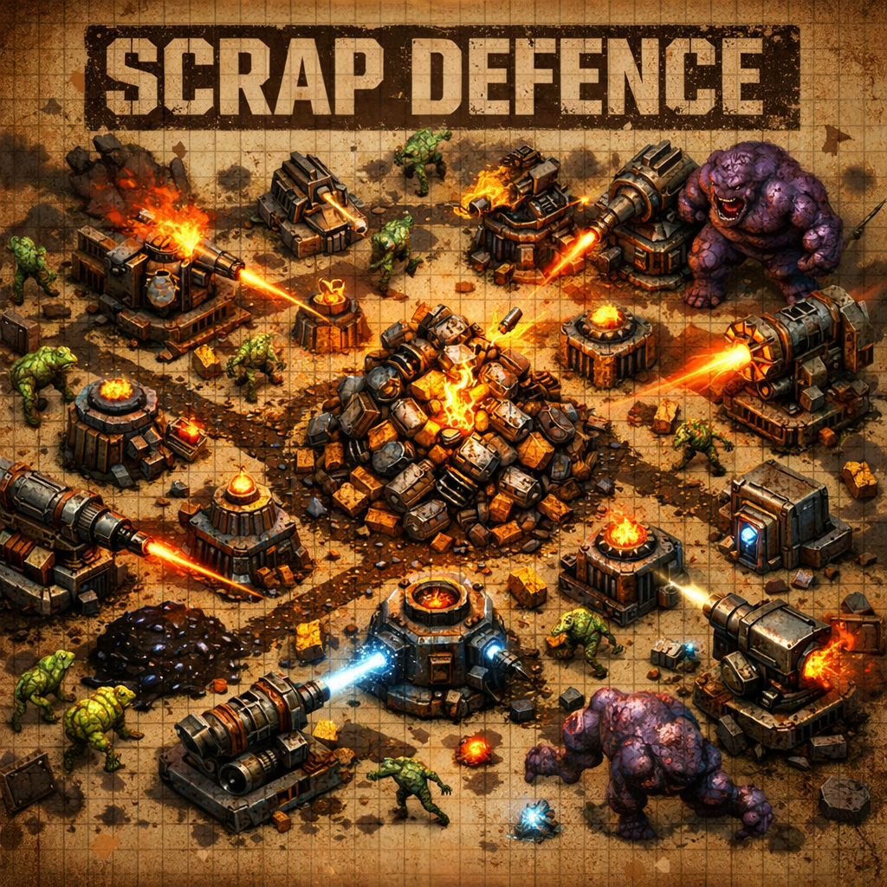

# Scrap Defence - Gameplay Guide

A post-apocalyptic tower defense where you defend your scrap pile from waves of mutants on a procedurally generated open field. No fixed paths — you maze the enemies with your towers.

## The Basics

You start with **200 scrap** and a pile in the center of the map. Enemies spawn from the edges and path toward your pile. If they reach it, they **steal scrap and flee**. If your pile hits zero and there's no scrap left anywhere, it's game over.

The game alternates between two phases:

- **Building** — Place towers, plan your maze. Press **Enter** to start the next wave.
- **Defending** — Towers fire automatically. Survive until all enemies are dead and all dropped scrap is collected.

There are **20 waves** of increasing difficulty.

## Controls

| Input | Action |
|-------|--------|
| **1-6** | Select tower type |
| **Left Click** | Place selected tower / Inspect placed tower |
| **Right Click** | Sell tower (60% refund) |
| **U** | Upgrade inspected tower |
| **Escape** | Deselect tower / Close inspection |
| **Enter** | Start next wave (Building phase) |
| **Scroll Wheel** | Zoom in/out |
| **Middle Mouse Drag** | Pan camera |
| **Home** | Reset camera |

## Towers

Towers block enemy pathing (except Tar Pit), so placement is how you build your maze. You must always leave at least one path from every map edge to your pile.

| # | Tower | Cost | Damage | Range | Fire Rate | Special |
|---|-------|------|--------|-------|-----------|---------|
| 1 | **Scrap Gun** | 50 | 10 | 80 | 1.0s | Reliable all-rounder |
| 2 | **Tar Pit** | 75 | 2 | 70 | Aura | **Slow 40%** — enemies walk through |
| 3 | **Explosive** | 125 | 25 | 100 | 3.3s | **AOE** — 70-unit blast radius |
| 4 | **Railgun** | 150 | 50 | 160 | 5.0s | Long range sniper |
| 5 | **Scrap Magnet** | 100 | 0 | 90 | Aura | **Pulls enemies + slows 50%** |
| 6 | **Chain Lightning** | 125 | 20 | 90 | 2.0s | **Chain** — arcs between enemies, 70% falloff |

**Tar Pit** is unique — it doesn't block pathing, so you can place it directly on enemy routes.

**Scrap Magnet** deals no damage but pulls enemies toward it and has the widest scrap collection range (90 units vs 30 for other towers).

**Chain Lightning** arcs between clustered enemies — each bounce does 70% of the previous hit's damage. Arc range increases with upgrades (60 → 80 → 100 units).

All towers automatically collect nearby scrap drops.

## Tower Upgrades

Click a placed tower (when no tower type is selected) to inspect it. Press **U** to upgrade.

Towers have **3 tiers**. Each upgrade boosts stats and brightens the sprite:

| Tier | Damage | Range | Fire Rate | Cost |
|------|--------|-------|-----------|------|
| 1 (base) | 1.0x | 1.0x | 1.0x | — |
| 2 | 1.4x | 1.1x | +15% faster | 100% of base cost |
| 3 | 2.0x | 1.2x | +30% faster | 150% of base cost |

Selling an upgraded tower refunds **60% of total investment** (base cost + all upgrade costs).

## Enemies

| Type | HP | Speed | Loot | Appears |
|------|----|-------|------|---------|
| **Shambler** | 50 | 40 | 10 | Wave 1+ |
| **Runner** | 30 | 80 | 15 | Wave 3+ |
| **Brute** | 150 | 25 | 30 | Wave 6+ |

Enemies get tougher each wave: **+15% HP** and **+5% speed** per wave. Spawn rate also increases — starting at 1.5s between spawns, dropping to 0.3s by late waves.

### Boss Waves

Every 5th wave (**5, 10, 15, 20**) is a **solo boss wave** — one massive enemy replaces the regular horde.

| Stat | Value |
|------|-------|
| **Base HP** | 500 |
| **Speed** | 20 |
| **Loot** | 150 scrap |
| **Size** | 28 px (largest enemy) |

Each boss spawns with a **random trait** — check the wave preview to plan your defense:

| Trait | Effect | Counter |
|-------|--------|---------|
| **Regeneration** | Heals +5 HP/sec | Sustained DPS — don't rely on chip damage |
| **Armor** | -10 damage per hit (minimum 1) | High-damage towers (Railgun, Explosive) |
| **Splitting** | Spawns 3 Shamblers on death | Keep defenses up after the boss drops |

Boss HP scales with wave progression like regular enemies (+15% per wave), so the wave-20 boss has nearly 4x the base HP.

When killed, enemies drop scrap on the ground. Drops last **10 seconds** (they blink before expiring), so tower placement near kill zones matters for collection.

If an enemy reaches your pile, it grabs scrap and runs for the nearest edge. Kill it before it escapes or that scrap is gone for good.

## Economy Tips

- Right-click a placed tower to sell it for **60% of total investment** — useful for reshaping your maze mid-game.
- Upgrading towers is more scrap-efficient than placing new ones — a max-tier ScrapGun costs 150 total but hits for 2x damage.
- Killing enemies is your only income — don't let drops expire.
- Tower scrap collection auras pull nearby drops automatically.
- Scrap Magnets have 3x the collection range of other towers — great near kill zones.
- Your pile shrinks visually as scrap decreases. If it empties, you lose.
- Enemies that escape with stolen scrap permanently reduce your total economy.

## Map

The grid is procedurally generated each game with **obstacle clusters** (rubble/ruins) covering ~8% of the field. These block both placement and pathing, creating natural chokepoints to build around.
